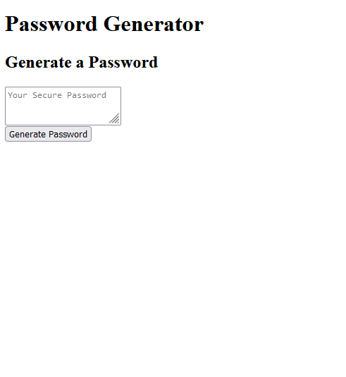

# JavaScript Password Generator

## Description

This project was my first homework assignment that would implement JavaScript, and I think it shows quite a bit.

The password generator is fully user defined, taking into itself four different data types: lower case and upper case letters, numbers, and special characters. While I was given starter code, I did have to write most of the JavaScript sans the writePassword function and the DOM Selections from scratch. I initially approached the project with a focus on scaling, starting with small functionalities before scaling up to include more and more. The main issue I had with that approach was that I remained too dedicated to my old code instead of fully "refactoring" each work session. This ended me up with *really* messy code I wasn't sure I could have completed on my own, but my TA, Juan Torres, came in in the last moment and really helped me scale back, allowing the final product to be sleek and fully functional.

Link to Live Site: [Here](https://shrcker.github.io/tania-javascript-hw/)

## Usage

The site's very minimalist, all a user has to do is click "Generate Password" and answer all of the incoming prompts. The first prompt will always ask you for the password's length, determining the cap on the random number generator, before it goes on to ask for each data type. Try different passwords of different types and lengths!

## Credits

This final bit of code would not have been possible without Juan Torres's help. There was no way anyone as inexperienced as me would have been able to dig myself out of my own hole without it.

## Features

Randomly generates a password from a user-defined list of characters.

## How to Contribute

Feel free to download and refactor the code if you wish to provide suggestions for improvement!